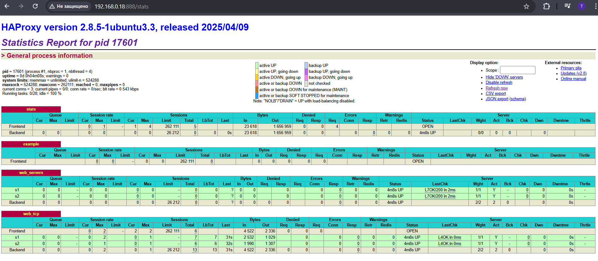

# Домашнее задание к занятию "Кластеризация и балансировка нагрузки"

**SFLT-46 / Ларионов Сергей**

---

## Задание 1: Настройка HAProxy с балансировкой Round-Robin на уровне 4

#### Процесс выполнения:

1.Созданы два Python-сервера на портах 8888 и 9999
2.Установлен и настроен Nginx с балансировкой нагрузки
3.Настроен UFW для работы с Nginx
4.Реализована балансировка HTTP (порт 80) и TCP (порт 8080) через Nginx
5.Установлен и настроен HAProxy с:
  - HTTP-балансировкой на порту 8088
  - TCP-балансировкой на порту 1325
6.Веб-статистикой на порту 888
7.Настроена интеграция Nginx → HAProxy

```bash
# Тестирование серверов
curl http://localhost:8888
curl http://localhost:9999
```

# Тестирование Nginx балансировки
curl -H 'Host: example-http.com' http://localhost

# Тестирование HAProxy
curl -H "Host: example.com" http://localhost:8088/
curl http://127.0.0.1:1325

# Проверка конфигураций
sudo nginx -t
sudo haproxy -c -f /etc/haproxy/haproxy.cfg

#### Результат:
+Балансировка работает корректно с распределением 3:1
+Отработана отказоустойчивость (при остановке одного сервера трафик идет на второй)
+Интеграция Nginx → HAProxy функционирует штатно
+Все конфигурации прошли проверку на корректность


Скриншот: Статистическая страница HAProxy.
Ключевые метрики:
✅Оба сервера здоровы (UP status)
✅HTTP проверки проходят (L7OK/200)
✅TCP проверки проходят (L4OK)
✅Балансировка работает (по 3 запроса на каждый сервер в HTTP)
✅Трафик распределяется корректно

<br><br>


Скриншот: «Перенаправление запросов на разные серверы при обращении к HAProxy».

## Ссылка на файл в Google Docs
[Файл haproxy.cfg](https://drive.google.com/file/d/1v742YhVI5kbIJfQRN8hlgx7j5pxXF4Jr/view?usp=drive_link)

---

## Задание 2: Настройка HAProxy с балансировкой Weighted Round Robin на уровне 7

#### Процесс выполнения:

1.Создан третий сервер на порту 9000.
```bash
mkdir http3
echo "Server 3 :9000" > ~/http3/index.html
python3 -m http.server 9000 --bind 0.0.0.0
```

2.Открыт порт 9000 в UFW. 
```bash
sudo ufw allow 9000
sudo ufw reload
```

3.Добавлен сервер в конфигурации:
  +В Nginx (/etc/nginx/include/upstream.inc)
  +В HAProxy (/etc/haproxy/haproxy.cfg).    
4.Перезагружены сервисы.  
5.Отредактирован haproxy.cfg + перезагрузка  

#### Результат проверки

✅Nginx балансировка (порт 80): все 3 сервера работают в ротации
✅HAProxy HTTP (порт 8088): балансировка между 3 серверами
✅HAProxy TCP (порт 1325): равномерное распределение запросов
❌Прямые запросы на порт 8088 без Host header: 503 ошибка (ожидаемо)

#### Статистика распределения:

HAProxy HTTP балансировка (порт 8088):
✅Сервер 1 - 2, Сервер 2 - 3, Сервер 3 - 4 запроса

HAProxy TCP балансировка (порт 1325):
✅Идеальное распределение 3:3:3

# Итог: 
Система балансировки настроена корректно, обрабатывает 3 сервера с разными алгоритмами распределения нагрузки.


Скриншот: Статистическая страница HAProxy.

<br><br>


Скриншот: «Перенаправление запросов на разные серверы при обращении к HAProxy».

## Ссылка на файл в Google Docs
[Файл haproxy.cfg](https://drive.google.com/file/d/1axLWRGplbUYwVGEkb6v4IQ5QxpPsLhzX/view?usp=drive_link)

---
